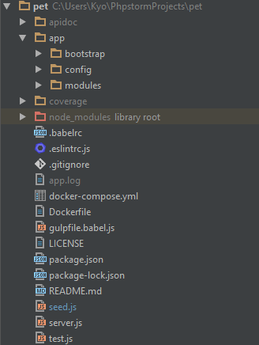

# MEN.js (v.1)
By Kyo

     M (Mongodb)   E (Express.js)    N (Node.js)
  

# Introduction
MEN.js stays clean and simple with only API orientated features. It has modular 
design to maintain a simple and readable code structure.

# Application Structure

- {apidoc}
this is the API documentation generated by the command "npm run apidoc"
  
- {coverage}
a test result report generated by running the yadda BDD test cases with command "npm run test"
  
- {app}
main application files  
    - {bootstrap}
        holds the key to bootstrap the express server and the mongodb
        - {express.js} implementation of the express server with loading the routes, 
        models, and applying middleware
        - {index.js} main application bootstrap file
        - {logger.js} access logging
        - {mongoose.js} mongoose initialization implementation
    - {config}
        define the environment configuration. The configuration file is determined by the 
        NODE_ENV environment variable. e.g. setting NODE_ENV to "development" would 
        apply the configuration file "development.js"
    - {modules}
        application is divided into different modules
        - {core} necessary functions / classes to be EXTENDED by other modules
        - {other modules}
            - {config} module configuration settings
            - {constants} module constants for models or other spec
            - {controllers} module controllers for routes (extend core controller)
            - {helpers} module helpers define util functions
            - {routes} module routes (every route has to define apidoc spec.) 
             ** for writing api spec, you can use any error codes define in different modules error folder i.e. <module>/errors **
            - {seed} define the seed data for the module
            - {tests} define the yadda BDD test cases for the module
    - {seed.js}
        seed data injection entry point
    - {server.js}
        express server application entry point
    - {test.js}
        yadda test entry point
    - {other root files}
        - used eslint for code style checking, gulp for task automation

# Prerequisite
1. node 8.2
2. mongodb 3.2
3. copy /app/config/local.example.js to /app/config/local.js, and modify the setting if needed 

# Bootstrap
1. sudo
2. npm i -g pm2
3. npm i -g gulp
4. npm i -g cross-env
5. npm i
6. npm run test
7. npm run apidoc
8. npm run start

# eslint
npm run lint
>Remark: you may see many errors as not all linting problems are fixed. This project is to demo to use this technique

# Docker
1. install docker
2. switch to project root directory
3. docker-compose up -d

To rebuild this image you must use `docker-compose build` or `docker-compose up --build`.
